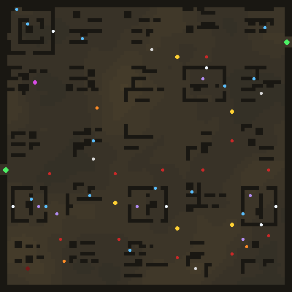
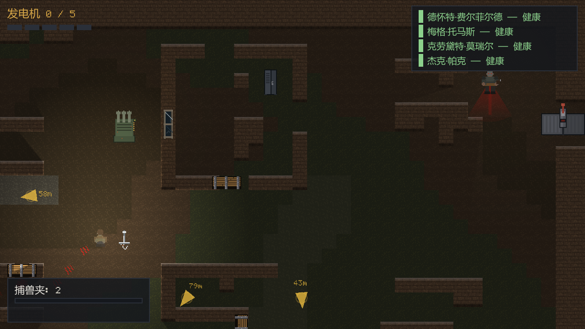
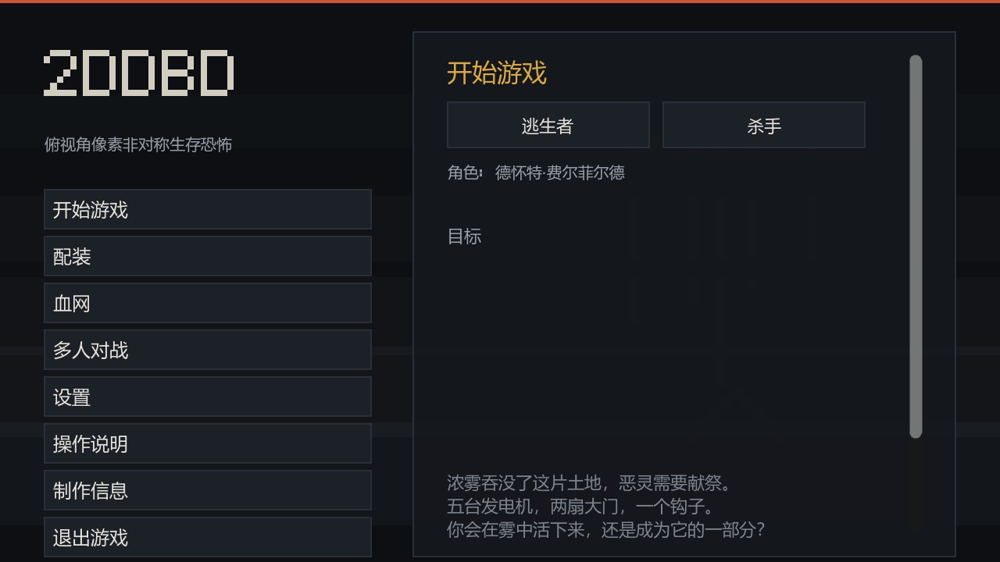

# 2DDBD

**一款俯视角 2D 像素风非对称生存恐怖游戏 —— 对《黎明杀机》的致敬之作。**

[English README](README.md) · [Planning 规划书](Planning/Planning.md)

一名杀手，四名逃生者，五台发电机，两扇大门。修好机器，打开出口，或者把他们都挂上钩子。

---

## 这是什么

2DDBD 把《Dead by Daylight》的核心对抗循环完整地搬进了 2D 俯视角像素世界：

```
逃生者：修 5 台发电机 → 拉下出口大门开关 → 逃出去
杀手　：击倒 → 抱起 → 挂钩 → 献祭
```

它由 **Godot 4.5.1 + GDScript** 从零写成。仓库里没有一个外部素材文件 ——
所有像素画由 `tools/gen_sprites.py` 程序化生成，所有音效由 `tools/gen_audio.py` 程序化合成，
地图由 `MapGenerator` 按种子确定性生成。克隆下来就能完整复现全部资源。

---

## 玩法特性

### 逃生者
- 奔跑 / 行走 / 蹲伏三档移动，翻窗、放板、翻越、躲柜子
- 修机、治疗自己、治疗队友、救援挂钩队友、扶起倒地队友
- **技能检定**：修理与治疗时出现圆环指针，按空格命中金色区域判定完美 / 不错 / 失误，失误会爆机并暴露位置
- 四级血量：健康 → 受伤 → 倒地 → 濒死，倒地后爬行、被抱起时扭动挣脱
- 挂钩三阶段（与原作一致）：**第一次**挂钩有 60 秒救援窗口和一次 4% 自救机会；
  **第二次**直接进入挣扎阶段，必须持续按住交互键对抗恶灵；**第三次**立即献祭、没有救援窗口。
  同一个人挂回同一根钩子，额外推进一个阶段
- 奔跑会留下**爪痕**，受伤会留下**血迹**，蹲伏降低被发现概率
- 4 件道具（医疗包 / 手电筒 / 工具箱 / 地图）+ 每件 3 个配件
- 12 个逃生者技能（需在血网中解锁）

### 杀手 —— 陷阱杀手
- 挥刀（带前摇与后摇）、蓄力突进
- **力量：捕兽夹** —— 在地面布置夹子，踩中的逃生者被定住，需要赌概率挣脱
- 抱起、扛肩、走到最近的空钩子上挂钩献祭
- 踩碎放倒的木板、翻越窗户（比逃生者慢得多，这正是逃生者绕圈的基础）
- **杀戮欲望**：追击同一目标 15 / 25 / 35 秒获得三档加速，被板砸或拉开距离会重置
- **恐惧半径**：32 米心跳，距离越近心跳越快
- 6 个杀手技能 + 6 个捕兽夹配件（需在血网中解锁）

### 地图与场景
- 5 张地图：汽车坟场 / 麦克米伦庄园 / 冷风农场 / 山冈宅邸 / 奥蒙德矿井
- **结构优先的程序化生成**：地图先被划成 16×16 的地块网格，每块按蓝图建造
  —— 主建筑、中型建筑、户外体操区（U 形墙 + 板）、小屋、户外掩体场
- 每张地图有**独立的布局参数**：汽车坟场是散乱的小屋群，冷风农场大部分是开阔地，
  奥蒙德建筑最密 —— 同一套生成器产出五种完全不同的地形手感
- 主建筑是 13×13 的外墙 + 内部环廊：外围一圈、内部一圈，三道门两个窗，可以绕很久
- **窗户只打在确认两侧都可走的外墙上**，木板只放在真正的咽喉要道 —— 生成时就保证可达
- 地面纹理由**值噪声**分片：同一片草地/泥土成块出现，而不是逐格随机（那是电视雪花）
- 地图种子化：布局、物件分布、出生点全部可复现；同一张图换个种子就是另一个地方
- 墙体阻挡移动 **也阻挡视线**（TileSet 内置光照遮挡体），制造真实的追逐压迫感
- 小地图（Tab）标出已探明的发电机、钩子、大门、地窖



*麦克米伦庄园。深色是墙，黄点是发电机，红点是钩子，白点是窗户，蓝点是板，绿点是大门。*

- 自带**地图导出工具**：`--dump-map` 把生成结果渲染成 PNG 并打印一份可读性报告
  （开放率 / 可达性 / 空旷度 / 走廊占比 / 发电机间距 / 钩子覆盖）

### 杀手红光与视线遮挡
- **红光**：杀手面朝方向脚下的锥形红光（**3 米** / 64°），逃生者隔着墙也能看到光斑扫过，
  由此判断杀手要往哪边压 —— 这是原作最重要的可读性设计之一。
  它是一小片贴在脚下的光，不是探照灯：11 米时会照亮小半个屏幕，反而读不出"他在朝哪看"
- **杀手本能**：杀手视角会在屏幕边缘显示指向目标的箭头（被挂钩的逃生者 / 已开的地窖 /
  通电的大门 / 有进度的发电机）并标出距离。逃生者没有这个 —— 他们整局的核心就是"不知道"
- **视线遮挡**：环境光照 + 墙体光照遮挡体 + 角色点光源（带阴影），墙后真的会暗下去；
  被墙挡住的敌人自动半透明；躲在柜子里的逃生者不可见
- **杀戮欲望**：追击同一个目标 15 / 25 / 35 秒升三档，红光随之变深变粗，
  杀手视角屏幕边缘浮出血色晕影；被板砸或彻底拉开距离会重置（含 16 米宽限窗口）

### 实际画面



*杀手视角。脚下那一小片红斑就是 3 米红光；屏幕边缘的黄色箭头是杀手本能，带目标距离。*



*菜单。拉丁字母走自制的 5×7 像素位图字体，中文自动回退系统字体。*

### 血网成长系统
- 每个角色一份独立的环状节点图，用血网点解锁技能 / 道具 / 配件 / 血点奖励
- 层级越高环路越宽、消耗越高；解锁满 60% 即可晋升至下一层
- 血网由 `(角色, 层级)` 种子确定性生成 —— 存档只记录层级与已取节点，体积极小
- 解锁的技能会立即出现在配装页面；未解锁的技能显示为锁定状态

### 系统
- 有限状态机驱动全部角色行为（逃生者 11 个状态 / 杀手 8 个状态）
- A\* 网格寻路 + 行为决策 AI，可单机打完整局
- 动态音频：心跳随恐惧半径变化，追逐音乐切换，程序化合成 51 个音效
- 浅色 / 深色双主题，中英双语，全部界面可实时切换
- 摄像机平滑跟随、追逐时轻微拉远、受击屏幕震动

---

## 操作

| 按键 | 逃生者 | 杀手 |
|---|---|---|
| `W A S D` | 移动 | 移动 |
| `Shift` | 行走（不留下爪痕） | — |
| `Ctrl` | 蹲伏 | — |
| `Space` | 交互（长按）/ 检定 / 挣扎 / 扭动 | 抱起 / 挂钩 |
| `E` | 交互（同 Space） | 同左 |
| `F` | 使用道具 | — |
| 鼠标左键 / `J` | — | 挥刀 |
| 鼠标右键 / `K` | — | 放置 / 回收捕兽夹 |
| `Tab` | 小地图 | 小地图 |
| `F11` | 全屏 / 窗口切换（无边框） | 同左 |
| `Esc` | 暂停菜单 | 暂停菜单 |

---

## 运行

### 方式一：直接玩（Windows）

```
build/2DDBD.exe
```

双击即玩，无需安装，无需 Godot。所有资源都打包在单个 exe 内。

### 方式二：用 Godot 编辑器打开

需要 **Godot 4.5.x**（本项目在 4.5.1 stable 上开发）。

```
1. 用 Godot 打开本目录（选中 project.godot）
2. 等待首次资源导入完成
3. 按 F5 运行
```

### 方式三：从源码重新生成全部资源

```bash
python tools/gen_sprites.py     # 生成 SVG 源 + PNG 运行时纹理
python tools/gen_audio.py       # 合成全部 51 个音效（约 75 秒音频）
```

两个脚本都**只依赖 Python 标准库**（PNG 由 zlib 手工编码），无需安装任何第三方包。
生成是确定性的：同一个脚本版本永远产出逐字节相同的资源。

---

## 项目结构

```
2DDBD/
├── project.godot              Godot 工程配置（含全部输入映射）
├── icon.svg                   程序化生成的应用图标
├── Planning/Planning.md       完整开发规划书（机制对照表 / 参数表 / 里程碑）
├── export_presets.cfg         Windows 导出预设
├── src/
│   ├── autoload/              7 个全局单例
│   │   ├── game_config.gd     全部可调数值的单一数据源
│   │   ├── event_bus.gd       全局信号总线（角色与 UI 完全解耦）
│   │   ├── save_data.gd       设置与血网点持久化
│   │   ├── locale.gd          中英双语文本表（约 200 条）
│   │   ├── audio_director.gd  混音总线 + 动态心跳 + BGM 调度
│   │   ├── net_bridge.gd      网络后端抽象
│   │   └── scene_router.gd    带淡入淡出的场景切换
│   ├── core/                  枚举、工具函数、精灵图集切片器
│   ├── actors/
│   │   ├── character_base.gd  移动 / 动画 / 视线 / 爪痕血迹 / 眩晕
│   │   ├── state_machine.gd   通用有限状态机
│   │   ├── survivor/          逃生者 + 11 个状态类
│   │   └── killer/            杀手 + 8 个状态类 + 捕兽夹力量
│   ├── interactables/         发电机 / 钩子 / 木板 / 窗 / 柜 / 地窖 / 大门 / 箱子 / 夹子
│   ├── ai/                    逃生者 AI、杀手 AI、卡住看门狗
│   ├── systems/               比赛控制、技能检定
│   ├── map/                   确定性程序化地图生成
│   ├── net/                   离线 / ENet 局域网 / WebRTC 无服务器 P2P
│   ├── ui/                    主菜单、配装、设置、多人、教程、HUD、结算、主题
│   └── data/                  JSON 配表（杀手 / 逃生者 / 技能 / 道具 / 地图）
├── assets/
│   ├── sprites/               运行时 PNG 纹理（24 个文件，程序化生成）
│   ├── source_svg/            对应的 SVG 矢量源（可手工编辑）
│   └── audio/                 51 个程序化合成音效（WAV 22.05 kHz mono）
├── tools/
│   ├── gen_sprites.py         像素画生成器（SVG + PNG 双输出）
│   └── gen_audio.py           音效合成器（纯标准库）
├── scenes/                    boot / main_menu / match / hud / results
└── build/                     导出产物
```

---

## 技术要点

**为什么用 SVG 做美术源？**
Godot 4 内置 ThorVG 导入器，`.svg` 可以直接当纹理用。像素画写成整数坐标的 `<rect>` 运行段，
矢量源文件小、可脚本批量换配色（同一套人形骨架产出 4 套角色配色），
同时游戏内使用的是 1:1 的 PNG，彻底规避光栅化器的抗锯齿让像素糊边。

**数值体系忠于原作。** `1 tile = 16 世界像素 = 1 米`，于是《黎明杀机》的
真实米/秒数值可以原样写进代码：逃生者 4.0 m/s、杀手 4.6 m/s、扛人 3.68、
攻击后摇 2.76、恐惧半径 32 米、发电机 80 秒、出口开关 20 秒、踩板 2.6 秒……

**网络。** 三层后端共用同一套角色逻辑：
`NetOffline`（单机，AI 补满 5 席）、`NetEnet`（局域网主机权威）、
`NetWebRTC`（无服务器 P2P —— 两名玩家各自复制一段 SDP 文本互相粘贴即可直连，不需要任何信令服务器）。

---

## 已知限制

- 联机层实现了大厅、握手与状态同步接口，但完整战斗同步未经多人实测，建议先玩单机。
- AI 会完成修机、逃跑、救援、治疗、追逐、挂钩整套循环，但板窗绕圈的博弈水平还比较朴素。
- UI 使用自制的 **5×7 像素位图字体**（`tools/gen_font.py` 从 95 个手写点阵字形生成 BMFont），
  中文自动回退到系统 CJK 字体。
- 地图是**确定性**的：同一个种子永远得到同一张图，联机时只需同步种子与地图 id。
- 血网的经济曲线（消耗 / 层宽）是纯函数，便于后续重平衡而不会破坏已有存档。

---

## 开发路线

见 [`Planning/Planning.md`](Planning/Planning.md) 的 8 个里程碑（M1 工程地基 → M8 联机与发布）。
下一个版本的重点：像素位图字体、更多杀手与力量、板窗博弈 AI、完整联机同步。

---

## Legal

非商业粉丝致敬 / 技术学习作品。《Dead by Daylight》及其角色、地图、商标归 **Behaviour Interactive Inc.** 所有。
本仓库**不包含任何原作素材文件** —— 全部图形与音频均由本仓库内的脚本程序化生成，可完整复现。

许可证：**Available License**（见 [LICENSE](LICENSE)，原文 <https://license.kscm.top/available.md>）。
